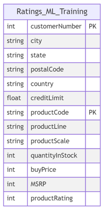

# AWS Batch & Stream Project: Recommender System Pipelines

## Overview

This project implements a complete batch and streaming architecture to build a recommender system. The goal is to handle product and user data, transform it for training purposes, and store the output embeddings in a vector database to provide real-time product recommendations.

The project is broken down into two parts:
1. **Batch Pipeline**: Creates training data for the recommender system and stores it in an Amazon S3 bucket.
2. **Streaming Pipeline**: Uses the trained model and vector database to provide real-time product recommendations based on user activity.

## Table of Contents
1. [Batch Pipeline](#1---implementing-the-batch-pipeline)
2. [Vector Database Setup](#2---creating--setting-up-the-vector-database)
3. [Connecting the Deployed Model](#3---connecting-the-deployed-model-to-the-vector-database)
4. [Streaming Pipeline](#4---implementing-the-streaming-pipeline)
5. [Technologies Used](#technologies-used)
6. [Setup Instructions](#setup-instructions)
7. [Usage](#usage)
8. [Conclusion](#conclusion)


---

## 1 - Implementing the Batch Pipeline

The batch pipeline ingests product and user data from an Amazon RDS MySQL database, transforms it using AWS Glue ETL, and stores the transformed data in an Amazon S3 bucket. The data is used to train the recommender system.

Key Steps:
- Connect to the RDS MySQL database to explore the `ratings` table.
- Run the AWS Glue ETL job to transform the data into a format suitable for training.
- Store the transformed data in an Amazon S3 bucket, partitioned by `customerNumber`.

Refer to the architectural diagram for the batch & stream pipeline:


## 2 - Creating & Setting up the Vector Database

In this step, we configure a PostgreSQL database with the `pgvector` extension to store embeddings (item and user vectors) generated by the recommender model.

Key Steps:
- Create a PostgreSQL database using Terraform with the `pgvector` extension.
- Upload the `item_embeddings.csv` and `user_embeddings.csv` files into the Vector DB.
- Query the Vector DB to retrieve recommendations.

## 3 - Connecting the Deployed Model to the Vector Database

Once the embeddings are loaded into the Vector DB, the deployed model (stored in an S3 bucket) interacts with the DB to fetch real-time product recommendations based on user activities streamed via AWS Kinesis.

## 4 - Implementing the Streaming Pipeline

The streaming pipeline listens to user activity via AWS Kinesis Data Streams. It then invokes an AWS Lambda function to provide recommendations based on the embeddings stored in the vector database.

Key Steps:
- Configure Kinesis Data Streams to collect user activity.
- Set up Kinesis Firehose to load data streams into an S3 bucket after invoking the Lambda function for recommendation inference.
- Lambda function performs real-time transformations and stores recommendations in S3.

---

## Technologies Used
- **AWS Services**: 
  - Amazon RDS (MySQL, PostgreSQL with `pgvector`)
  - Amazon S3
  - AWS Glue ETL
  - AWS Lambda
  - AWS Kinesis (Data Streams, Firehose)
- **Terraform**: Infrastructure as Code (IaC) for provisioning AWS resources.
- **PostgreSQL**: Database with vector support for fast retrieval of similar embeddings.
- **Python**: For handling scripts and data transformations.

---

## Setup Instructions

### 1. Environment Setup
- Clone the repository.
- Navigate to the `terraform` folder to configure the necessary AWS resources:
  ```bash
  cd terraform
  terraform init
  terraform plan
  terraform apply


### 2. Running the Batch Pipeline

- Initialize AWS Glue jobs by following the provided setup steps in scripts/setup.sh.

Setup the environment running the script `scripts/setup.sh`:

```bash
source ./scripts/setup.sh
```

This script installs the necessary packages (PostgreSQL and Terraform) and sets up some environment variables required to pass parameters into the Terraform configuration.


Go to the `terraform` folder. 

```bash
cd terraform
```

- Deploy and start the batch ETL process via Terraform.

Initialize the terraform configuration:

```bash
terraform init
```
To deploy the resources, run the following commands:

```bash
terraform plan
terraform apply
```

The transformed data has the following schema:    



### 3. Vector Database Configuration

- Set up the PostgreSQL Vector DB and upload the embedding files.

Sample S3 bucker folder structure for the trained model:

```bash
.
├── embeddings/
|   ├── item_embeddings.csv
|   └── user_embeddings.csv
├── model/
|   └── best_model.pth   
└── scalers/
    ├── item_ohe.pkl
    ├── item_std_scaler.pkl
    ├── user_ohe.pkl
    └── user_std_scaler.pkl   
```

The `embeddings` folder contains the embeddings of the users and items (or products) that were generated in the model. 

The `model` folder contains the trained model that will be used for inference.

The `scalers` folder contains the objects used on the preprocessing part for 
the training, such as 
[One Hot Encoders](https://hackernoon.com/what-is-one-hot-encoding-why-and-when-do-you-have-to-use-it-e3c6186d008f) 
and [Standard Scalers](https://en.wikipedia.org/wiki/Feature_scaling).

Hypothetically, The Data Scientist asked to upload the `item_embeddings.csv` and `user_embeddings.csv` files into a Vector Database (Vector DB). Those embeddings will be used by the recommender system in the streaming pipeline to provide product recommendations. 


**Creating the vector database**

For the vector database, you will create with Terraform an RDS PostgreSQL database with the `pgvector` [extension](https://github.com/pgvector/pgvector). 


### 4. Streaming Pipeline Deployment

- Configure Kinesis Data Streams and Firehose for real-time streaming.
- Ensure the Lambda function is connected to the vector database and S3.


## Usage

To use this project:

	1.	Run the batch pipeline to prepare training data and embeddings.

	2.	Deploy the trained model and upload embeddings to the vector database.

	3.	Stream user activity through Kinesis, and recommendations will be generated in real-time using the Lambda function.


## Conclusion

Author: ✍️

Freda Victor

[Project Blog](https://learndataengineering.hashnode.dev/building-a-recommender-system-on-aws-batch-and-streaming-pipelines)

September 2024

### Readings
- [Postgres flags](https://hasura.io/blog/top-psql-commands-and-flags-you-need-to-know-postgresql/)

- `classicmodels` [MySQL Sample Database](https://www.mysqltutorial.org/mysql-sample-database.aspx) 

- pgvector` [extension](https://github.com/pgvector/pgvector). 
